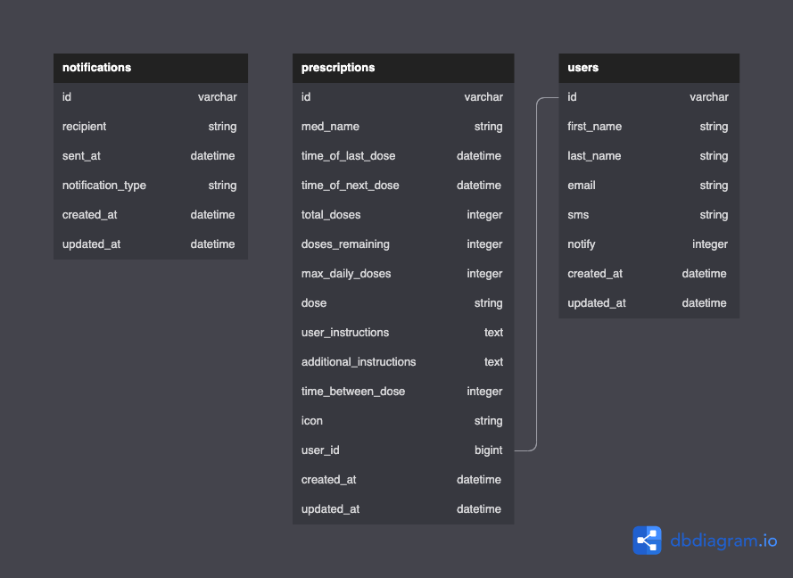

# My Meds API and Database


## **Background and Description**
This repository implements a GraphQL API and PostgreSQL database providing a micro-service for the [MyMeds FE](https://github.com/MyMeds-Turing/my_meds_fe) web application.
SMS and Email notifications are implemented using [Twilio](https://www.twilio.com/)'s suite of micro-services.

### Disclaimer
This project is designed for usage with a specific front-end React application.  If using it for your own project, please provide credit to:
John Hennerich (jhennerich), Zel Imbriaco (zel-imbriaco), Maximillian Wagner (MWagner3), and Katy Harrod (mcharrod).

## **Table of Contents**
- [Background and Description](#background-and-description)
- [Schema](#schema)
- Requirements and Setup (for Mac):
    - [Gems Utilized](#gems-utilized)
    - [SetUp](#usage-instructions)
- [GraphQL Endpoints](#graphql)
    - [Queries](#queries)
    - [Mutations](#mutations)
- [Future Iteration Goals](#future-iteration-goals)
- [Contributors](#contributors)
## **Schema**


### **Gems Utilized**
---
- [twilio-ruby](https://github.com/twilio/twilio-ruby)
- [graphql](https://graphql-ruby.org/)
- [graphiql-rails](https://github.com/rmosolgo/graphiql-rails)
- [sidekiq](https://github.com/mperham/sidekiq)
- [rack-cors](https://github.com/cyu/rack-cors)
- [capybara](https://github.com/teamcapybara/capybara)
- [faraday](https://github.com/lostisland/faraday)
- [figaro](https://github.com/laserlemon/figaro)
- [jsonapi-serializer](https://github.com/jsonapi-serializer/jsonapi-serializer)
- [pry](https://github.com/pry/pry)
- [shoulda-matchers](https://github.com/thoughtbot/shoulda-matchers)
- [simplecov](https://github.com/simplecov-ruby/simplecov)
- [rspec](https://relishapp.com/rspec)

## **Usage Instructions**
To install the My Meds Database for your own personal usage, please do the following:
1. Fork this repository.
2. Clone your forked repository to your desired back-end hardware.
3. In the terminal, navigate to the `my_meds_be` folder and run `bundle install`.
4. While still in the terminal, run `rails db:{drop,create,migrate,seed}` to populate your database with seed data.`
5. Make any changes to the database as necessary, and deploy to your database-hosting service of choice.


## **GraphQL**
Our GraphQL endpoints fall into two categories: queries and mutations.

### **Queries**

1. [**fetchUser(id: ID)**](#fetch-user) *Finds a specific user in the database*
* Example Query
```
{
  fetchUser(id: 1) {
    id
    firstName
    lastName
    fullName
    email
    sms
    notify
    createdAt
    updatedAt
  }
}
```
  * Example Response
```
{
  "data": {
    "fetchUser": {
      "id": "1",
      "firstName": "John",
      "lastName": "L",
      "fullName": "John L",
      "email": "John.H@email.com",
      "sms": "5551234567",
      "notify": 0,
      "createdAt": "2022-07-13T23:17:33Z",
      "updatedAt": "2022-07-13T23:17:33Z"
    }
  }
}
```

2. [**fetchUsers**](#fetch-users) *list all users in the database*
* Example Query
```
{
      fetchUsers {
        id
        firstName
        lastName
        fullName
        email
        sms
        notify
        createdAt
        updatedAt
      }
}
```
  * Example Response
  ```
  {
  "data": {
    "fetchUsers": [
      {
        "id": "1",
        "firstName": "John",
        "lastName": "L",
        "fullName": "John L",
        "email": "John.H@email.com",
        "sms": "5551234567",
        "notify": 0,
        "createdAt": "2022-07-13T23:17:33Z",
        "updatedAt": "2022-07-13T23:17:33Z"
      },
      {
        "id": "2",
        "firstName": "Paul",
        "lastName": "M",
        "fullName": "Paul M",
        "email": "Paul.M@email.com",
        "sms": "5551234567",
        "notify": 0,
        "createdAt": "2022-07-13T23:17:33Z",
        "updatedAt": "2022-07-13T23:17:33Z"
      }
    ]
  }
}
```
3. [**fetchRxs**](#fetch-rxs) *list all prescriptions in the database*
* Example Query
```
{
  fetchRxs {
    id
    medName
    timeOfLastDose
    timeOfNextDose
    totalDoses
    dosesRemaining
    maxDailyDoses
    dose
    userInstructions
    additionalInstructions
    timeBetweenDose
    icon
    userId
    createdAt
    updatedAt
  }
}
```
  * Example Response
```
{
  "data": {
    "fetchRxs": [
      {
        "id": "1",
        "medName": "Tylenol",
        "timeOfLastDose": "2022-07-13T23:17:33Z",
        "timeOfNextDose": "2022-07-14T23:17:33Z",
        "totalDoses": 500,
        "dosesRemaining": 500,
        "maxDailyDoses": 6,
        "dose": "200 mg",
        "userInstructions": "take pill, take with food",
        "additionalInstructions": "take 2 call me in the morning",
        "timeBetweenDose": 240,
        "icon": "path_to_icon",
        "userId": 1,
        "createdAt": "2022-07-13T23:17:33Z",
        "updatedAt": "2022-07-13T23:17:33Z"
      },
      {
        "id": "2",
        "medName": "Tylenol",
        "timeOfLastDose": "2022-07-13T23:17:33Z",
        "timeOfNextDose": "2022-07-17T23:17:33Z",
        "totalDoses": 500,
        "dosesRemaining": 500,
        "maxDailyDoses": 6,
        "dose": "200 mg",
        "userInstructions": "take pill, take with food",
        "additionalInstructions": "take 2 call me in the morning",
        "timeBetweenDose": 240,
        "icon": "path_to_icon",
        "userId": 2,
        "createdAt": "2022-07-13T23:17:33Z",
        "updatedAt": "2022-07-13T23:17:33Z"
      },
      {
        "id": "3",
        "medName": "OxyContin",
        "timeOfLastDose": "2022-07-13T23:17:33Z",
        "timeOfNextDose": "2022-07-15T23:17:33Z",
        "totalDoses": 25,
        "dosesRemaining": 25,
        "maxDailyDoses": 4,
        "dose": "5mg",
        "userInstructions": "take pill, take with food",
        "additionalInstructions": "take 2 call me in the morning",
        "timeBetweenDose": 240,
        "icon": "path_to_icon",
        "userId": 1,
        "createdAt": "2022-07-13T23:17:33Z",
        "updatedAt": "2022-07-13T23:17:33Z"
      }
    ]
  }
}
```

4. [**fetchUserRxs(id: ID)**](#fetch-user-rxs) *list all prescriptions in the database by user id*
* Example Query
```
{
  fetchUserRxs(id: 1) {
    id
    medName
    timeOfLastDose
    timeOfNextDose
    totalDoses
    dosesRemaining
    maxDailyDoses
    dose
    userInstructions
    additionalInstructions
    timeBetweenDose
    icon
    userId
    createdAt
    updatedAt
  }
}
```
  * Example Response
```
{
  "data": {
    "fetchUserRxs": [
      {
        "id": "1",
        "medName": "Tylenol",
        "timeOfLastDose": "2022-07-13T23:17:33Z",
        "timeOfNextDose": "2022-07-14T23:17:33Z",
        "totalDoses": 500,
        "dosesRemaining": 500,
        "maxDailyDoses": 6,
        "dose": "200 mg",
        "userInstructions": "take pill, take with food",
        "additionalInstructions": "take 2 call me in the morning",
        "timeBetweenDose": 240,
        "icon": "path_to_icon",
        "userId": 1,
        "createdAt": "2022-07-13T23:17:33Z",
        "updatedAt": "2022-07-13T23:17:33Z"
      },
      {
        "id": "3",
        "medName": "OxyContin",
        "timeOfLastDose": "2022-07-13T23:17:33Z",
        "timeOfNextDose": "2022-07-15T23:17:33Z",
        "totalDoses": 25,
        "dosesRemaining": 25,
        "maxDailyDoses": 4,
        "dose": "5mg",
        "userInstructions": "take pill, take with food",
        "additionalInstructions": "take 2 call me in the morning",
        "timeBetweenDose": 240,
        "icon": "path_to_icon",
        "userId": 1,
        "createdAt": "2022-07-13T23:17:33Z",
        "updatedAt": "2022-07-13T23:17:33Z"
      },
      {
        "id": "4",
        "medName": "Motrin",
        "timeOfLastDose": "2022-07-13T23:17:33Z",
        "timeOfNextDose": "2022-07-14T15:17:33Z",
        "totalDoses": 250,
        "dosesRemaining": 250,
        "maxDailyDoses": 4,
        "dose": "200mg",
        "userInstructions": "take pill, take with food",
        "additionalInstructions": "take 2 call me in the morning",
        "timeBetweenDose": 240,
        "icon": "path_to_icon",
        "userId": 1,
        "createdAt": "2022-07-13T23:17:33Z",
        "updatedAt": "2022-07-13T23:17:33Z"
      }
    ]
  }
}
```
### **Mutations**

1. [**deleteRx(id: ID)**](#delete-rx) *Deletes a prescription from the database*
* Example Mutation
```
{
  deleteRx(input: {id: 1}  ) {
          id
        }
      }
```
  * Example Response
```
{
  "data": {
    "deleteRx": {
      "id": "1"
    }
  }
}
```
2. [**addRx**](#addrx) *creates an entry in the prescription table*
* Available input fields
```
mutation {
     addRx(input: { params: {
        medName: "Asprin",
        totalDoses: 100,
        maxDailyDoses: 12,
        dose: "25 mg",
        userInstructions: "takepill, take with food",
        additionalInstructions: "take 2 a day",
        timeBetweenDose: 15,
        icon: "path_to_icon",
        userId: 1   
    }}){
    rx {
        id
        medName
    }
    }
    }
```
  * Example Response
```  
{
    "data": {
        "addRx": {
            "rx": {
                "id": "9",
                "medName": "Asprin"
            }
        }
    }
}
```
3. [**updateRx**](#updaterx) *updates an entry in the prescription table*
* Available input fields
```
mutation {
     rx: updateRx(
        input: {
         id: 11
         medName: "Adult Asprin",
        timeOfLastDose: "2022-07-15T04:03:27Z",
        timeOfNextDose: "2022-07-15T04:03:27Z"
        totalDoses: 100,
        dosesRemaining: 100,
        maxDailyDoses: 12,
        dose: "25 mg",
        userInstructions: "takepill, take with food",
        additionalInstructions: "take 2 a day",
        timeBetweenDose: 15,
        icon: "path_to_icon",
        userId: 1   
     }
     ){           
        id
        medName
        dosesRemaining
        }
     }
 ```
 * Example Response
 ```
{
    "data": {
        "addRx": {
            "rx": {
                "id": "9",
                "medName": "Asprin"
            }
        }
    }
}
```
4. [**takeMed**](#takeMed) *Reduces remaining doses by one.*
* Example Query
```
mutation {
        takeMed(input: {id: 3}  ) {
          id
          medName
          timeOfLastDose
          timeOfNextDose
          dosesRemaining
          userId
        }

      }
```
* Example Response
```
{
  "data": {
    "takeMed": {
      "id": "3",
      "medName": "Tylenol",
      "timeOfLastDose": "2022-07-19T20:35:25Z",
      "timeOfNextDose": "2022-07-20T00:35:25Z",
      "dosesRemaining": 490,
      "userId": 3
    }
  }
}
```
## **Future Iteration Goals**
* SMS and email reminders when it is time for users to take their medication.
* SMS and email reminders when users are running low on stock of a specific medication and need to get a refill from their doctor.

## **Contributors**
|  | |
| --- | --- |
|John Hennerich|[GitHub](https://github.com/jhennerich) &#124; [LinkedIn](https://www.linkedin.com/in/john-hennerich/)|
|Max Wagner|[GitHub](https://github.com/MWagner3) &#124; [LinkedIn](https://www.linkedin.com/in/maximilian-wagner3350/)|
|Zel Imbriaco|[GitHub](https://github.com/zel-imbriaco) &#124; [LinkedIn](https://www.linkedin.com/in/zimbriaco/)|
|Katy Harrod|[GitHub](https://github.com/mcharrod) &#124; [LinkedIn](https://www.linkedin.com/in/katyharrod/)|
